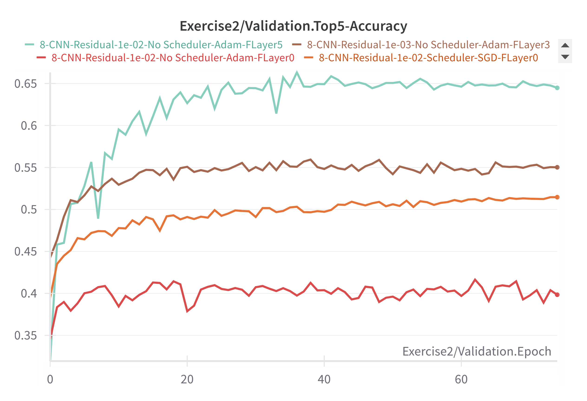

# Deep Learning Architecture Lab

All experiments can be viewed on wandb at the following link:
https://wandb.ai/AI-UNIFI/DLA_LAB_1?nw=nwusermirkobicchierai

## Exercise 1 (1.1/1.2/1.3)

To run experiments for exercises 1.1, 1.2, and 1.3, use:

```bash
python main.py
```

### Parameters

```
# Training Parameters
--epochs INT        Number of train epochs (default: 50)
--lr FLOAT          Learning rate for the optimizer (default: 1e-3)
--batch_size INT    Batch size of the dataloaders (default: 128)

# General Model Parameters
--MLP BOOL          If True use MLP, if False use CNN (default: True)
--residual BOOL     If True use skip connection (default: True)
--scheduler BOOL    If True use a cosine scheduler (default: True)

# MLP Parameters
--normalization BOOL    If True use normalization layers (only available for MLP model) (default: True)
--depth INT            Number of layers in the MLP (default: 40)
--width INT            Number of hidden dimension for all the layers in the MLP (default: 64)

# CNN Parameters
--layers INT [INT ...]    Number of layer pattern for the CNN Model (default: [2, 2, 2, 2])
                          [2, 2, 2, 2] resembles ResNet18
                          [3, 4, 6, 3] resembles ResNet34
                          [5, 6, 8, 5] resembles ResNet50

# Dataset
--dataset {MNIST,CIFAR10}    Choose dataset from MNIST, CIFAR10 (default: MNIST)
```

## Exercise 2.1

To run experiments for exercise 2.1, use:

```bash
python main2.py
```

### Parameters

```
--epochs INT                Number of train epochs (default: 75)
--batch_size INT            Batch size of the dataloaders (default: 128)
--num_layers INT            Number of the early layers to unfreeze, if 0 is a classical linear 
                            evaluation protocol (default: 0)
--scheduler BOOL            If True activate the cosine scheduler (default: True)
--optimizer {SGD,Adam}      Choose optimizer from SGD or ADAM (default: SGD)
--lr FLOAT                  Learning rate for the optimizer (default: 0.005)
--momentum FLOAT            Momentum for SGD optimizer (default: 0.9)
--path STR                  Path to the pretrained model of the CNN on CIFAR10 
                            (default: "Models/8-CNN-Residual-Scheduler.pth")
--residual BOOL             True if the pretrained model uses the skip connection trick (default: True)
--layers INT [INT ...]      Layer pattern of the pretrained model loaded (default: [2, 2, 2, 2])
```

## Experiment Setup

All executed experiments are set up in the bash files:
- `trainCNN.sh` 
- `trainMLP.sh`
- `fine_tune.sh` (for exercise 2)

## Results Exercise 1

In general, MLP models were trained on MNIST while CNN models were trained on CIFAR10. For the CNN implementation, I used PyTorch's BasicBlock and ResNet class implementation, making it slightly lighter and enabling the choice of whether to use skip connections or not.

On wandb, the experiments are categorized under two groups: "Residual" and "No Residual". The "Residual" group contains all training runs for models with active skip connections, while the other group does not have skip connections.

The experiments verified that when increasing the number of layers in models without skip connections, they become difficult to train due to the vanishing gradient problem, both for MLPs and CNNs. For MLPs, normalization layers seem to slightly mitigate this problem when present, but they don't completely solve it.

### MLP Accuracy on MNIST and Loss during training


### Gradient norm on MLP layers with depth 40 and width 128:

With skip connections:


Without skip connections:


### CNN Accuracy on CIFAR


### Gradient norm on CNN with 24 BasicBlocks:
With skip connections:


Without skip connections:


These are only some of the results from the conducted experiments. For a complete visualization, please check wandb (there are over 100 experiments).

## Results Exercise 2

For Exercise 2, I chose option 2.1, which involves fine-tuning a model from the previous exercise on CIFAR100.

I selected one of the smaller CNNs with 8 BasicBlocks from those previously tested, since they all performed more or less the same on CIFAR10 in terms of performance.

I used a KNN as a baseline on the extracted features of CIFAR100 from the model pretrained on CIFAR10, obtaining approximately 15% accuracy.

I fine-tuned the model by initially training only the new fully connected layer with output for 100 classes for CIFAR100, then unfreezing the first 3 layers, and after that the first 5 layers. In general, the Adam optimizer works better than SGD when more layers of the network are unfrozen.




