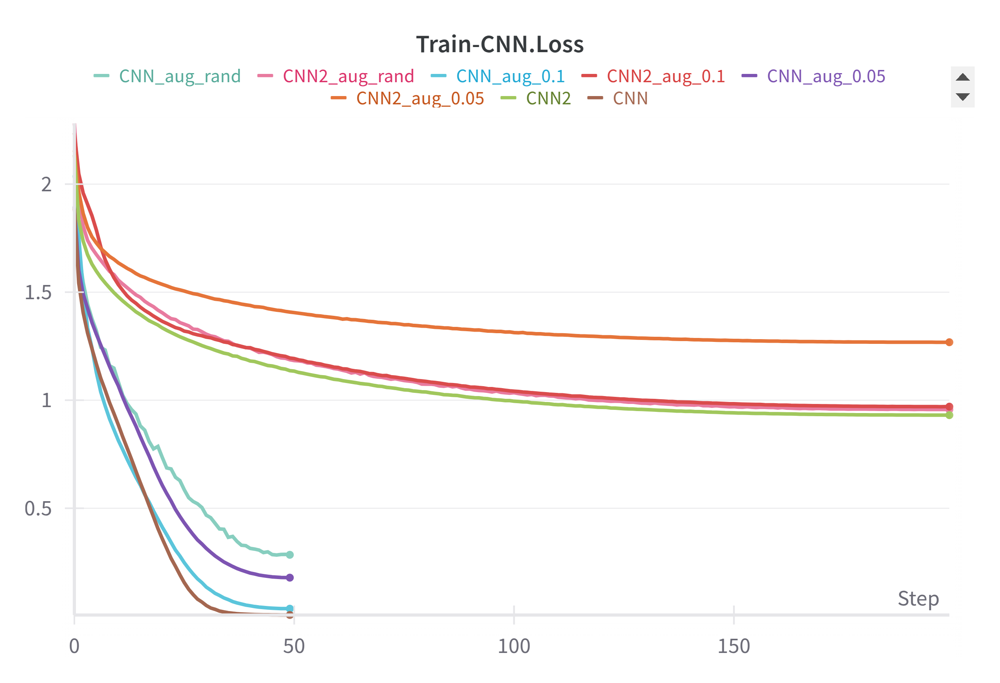
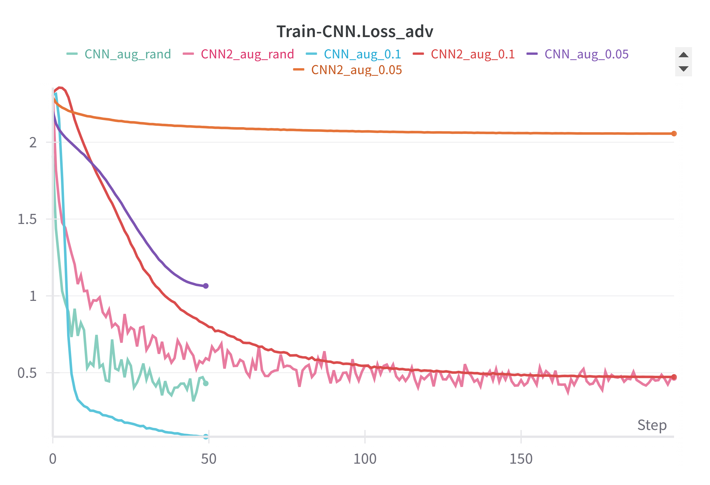
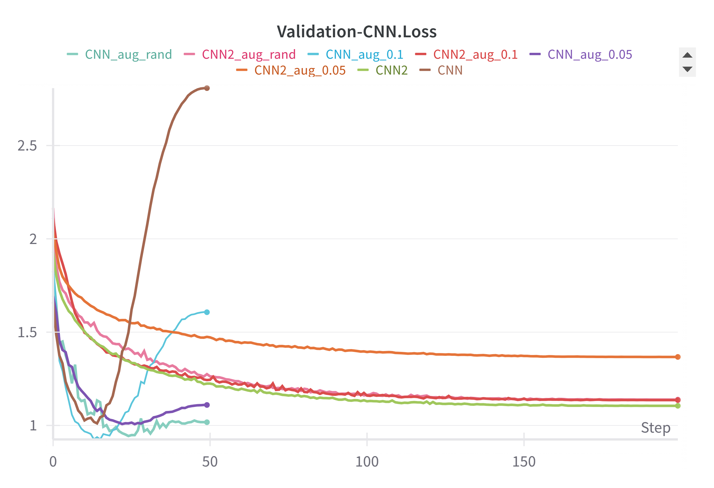
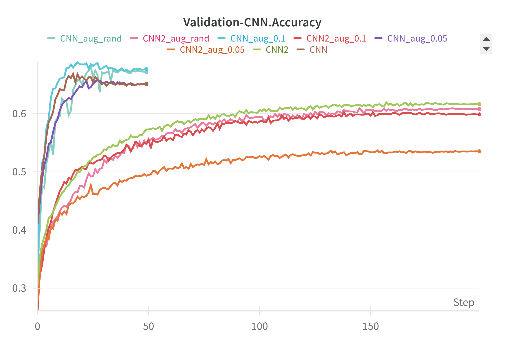
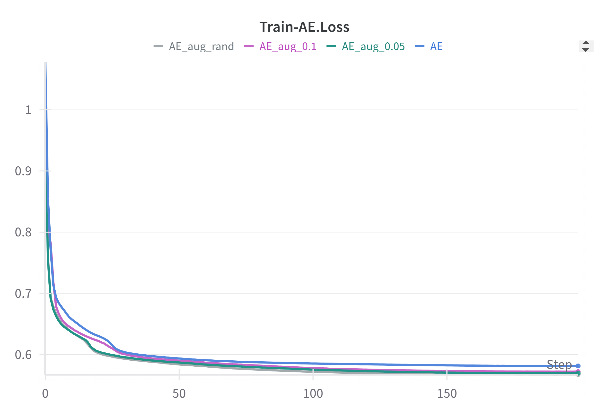
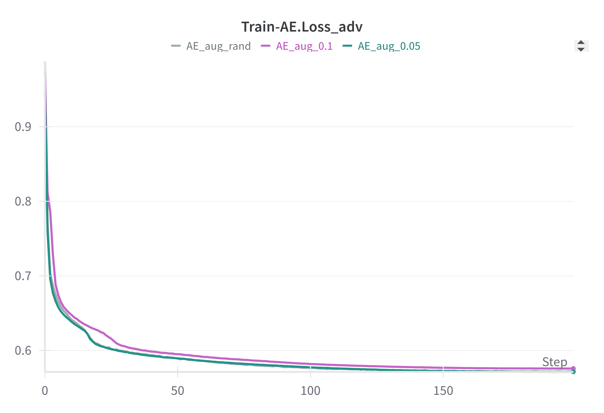
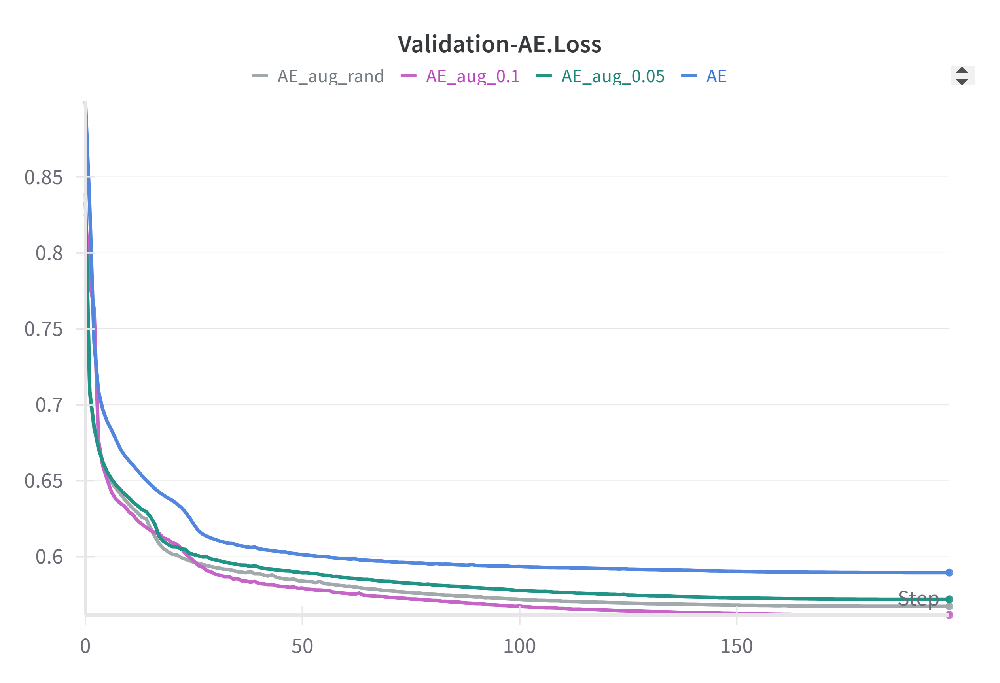

# Adversarial Training on Neural Networks

This repository contains code for experiments on CNN models and Autoencoders, focusing on adversarial training and FGSM (Fast Gradient Sign Method) attacks.

All experiments (CNN/CNN2 and AutoEncoder model training) can be viewed on wandb:
[https://wandb.ai/AI-UNIFI/DLA_LAB_4](https://wandb.ai/AI-UNIFI/DLA_LAB_4?nw=nwusermirkobicchierai)

All models (CNN/CNN2 and Autoencoder) are available in `model.py`. (Note: CNN is a more expressive and stable convolutional network compared to CNN2)

## Pretrained Models

Pretrained models are available in the `Models/` folder.

### Training Scripts

- To train all models without FGSM augmentation:
```bash
bash train_clean.sh
```

- To train all models with FGSM augmentation (Exercise 2.2):
```bash
bash train_fgsm.sh
```

### Custom Training

To train a specific model with different parameters:

```bash
python pretrain.py [--options]
```

```
# Training Parameters
--exp_name STR       Name of the experiment for Weights & Biases logging (default: "_New")
--batch_size INT     Batch size for training (default: 256)
--num_workers INT    Number of data loading workers (default: 12)
--epochs INT         Total number of training epochs (default: 200)
--lr FLOAT           Learning rate (default: 1e-4)

# FGSM Attack Parameters
--aug_fgsm BOOL      Enable FGSM-based data augmentation during training (default: True)
--rand_epsilon BOOL  Use random epsilon values between 0.01 and 0.2 for FGSM (default: False)
--epsilon FLOAT      Fixed epsilon value for FGSM (ignored if --rand_epsilon is True) (default: 0.05)

# Model Parameters
--train_cnn BOOL     Enable training of the CNN model (default: True)
--cnn_ty BOOL        If True, use the more powerful CNN model; if False, use CNN2 (default: False)
--train_AE BOOL      Enable training of the autoencoder model (default: False)
```

### Training base results

#### CNN and CNN2 Models

The **CNN** model is more expressive and stable compared to the **CNN2** model, which is simpler and requires fewer epochs to converge to a reasonable performance.  
Specifically:
- **CNN2** converges in approximately **200 epochs**
- **CNN** converges in about **50 epochs**  

Both models are trained using the **Adam optimizer** with a learning rate of **0.0001**, and a **cosine annealing scheduler**.

The **adversarial loss (`loss_adv`)** shown in the plots refers to the loss computed when the input batch is perturbed using the **FGSM (Fast Gradient Sign Method)**.

<table>
  <tr>
    <td></td>
    <td></td>
  </tr>
  <tr>
    <td></td>
    <td></td>
  </tr>
</table>

Overall, the CNN model achieves better accuracy than CNN2.  
FGSM-based data augmentation was tested using different epsilon values: **0.05**, **0.1**, and a **random value** uniformly sampled between **0.01 and 0.15**.  
This augmentation helps the CNN model reduce overfitting on the training set and improves generalization—especially when using **random epsilon**, which yielded the best performance in terms of accuracy.

---

### AutoEncoder Model

All AutoEncoder models are trained for **200 epochs** using the **Adam optimizer** (learning rate: **0.0001**) and a **cosine annealing scheduler**.  
The loss function used is **Mean Squared Error (MSELoss)**, calculated on the reconstruction output.  
The **adversarial loss (`loss_adv`)** shown in the graphs represents the loss when the input batch is perturbed using **FGSM**.

<table>
  <tr>
    <td></td>
    <td></td>
  </tr>
  <tr>
    <td></td>
    <td></td>
  </tr>
</table>

FGSM-based augmentation was evaluated with the same epsilon values as above: **0.05**, **0.1**, and a **random value between 0.01 and 0.15**.

## Exercise 1

To run all evaluations for all pretrained models and save results to `plot/es1/`:

```bash
bash es1.sh
```

For a specific model:

```bash
python es.py [--options]
```

```
# General Parameters
--batch_size INT     Batch size for data loading and training (default: 256)
--num_workers INT    Number of worker threads for data loading (default: 12)

# CNN Options
--cnn BOOL           Whether to test the CNN model (default: True)
--cnn_ty BOOL        If True, use the more powerful CNN model; if False, use CNN2 (default: False)
--model_path_cnn STR File path to the pretrained CNN model (default: "Models/CNN2_pretrain.pth")
--temp FLOAT         Temperature parameter for max_softmax score calculation (default: 1000)

# Autoencoder Options
--ae BOOL            Whether to test the autoencoder (AE) model (default: False)
--model_path_ae STR  File path to the pretrained autoencoder model (default: "Models/AE_pretrain.pth")
```

### Result Exercise 1

## Exercise 2 and 3.3

These exercises implement the FGSM Attack based on [PyTorch's FGSM tutorial](https://docs.pytorch.org/tutorials/beginner/fgsm_tutorial.html) with modifications.

For exercise 2.2, the implementation follows the training approach described in ["Training Augmentation with Adversarial Examples for Robust Speech Recognition"](https://arxiv.org/abs/1806.02782), testing with epsilon values of 0.05, 0.01, and random values between 0.01 and 0.15.

Exercise 3.3 is implemented only for CNN models, not for autoencoders.

To run all experiments and save all plots to `plot/es2/` and `plot/es3/`:

```bash
bash es2-3.sh
```

For a single specific pretrained model:

```bash
python es2-3.py [--options]
```

```
# General Parameters
--num_workers INT     Number of workers for data loading (default: 12)

# Autoencoder Options
--ae BOOL             If True, use the Autoencoder (AE) model (default: False)
--model_path_ae STR   Path to the pretrained AE model (default: "Models/AE_pretrain.pth")

# CNN Options
--cnn BOOL            If True, use the CNN model (default: True)
--cnn_ty BOOL         If True, use the more powerful CNN model; if False, use CNN2 (default: True)
--model_path_cnn STR  Path to the pretrained CNN model (default: "Models/CNN_pretrain.pth")
--target_class INT    Target class index for exercise 3.3 (default: 0)
```

### Result Exercise 2.1

### Result Exercise 2.2

### Result Exercise 3.3